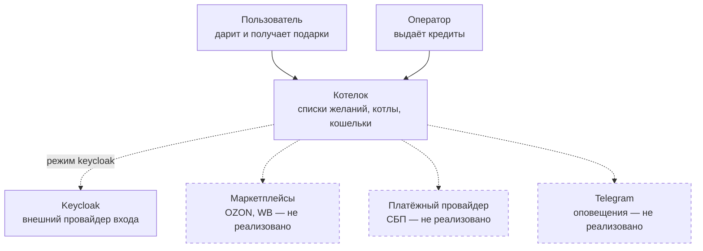
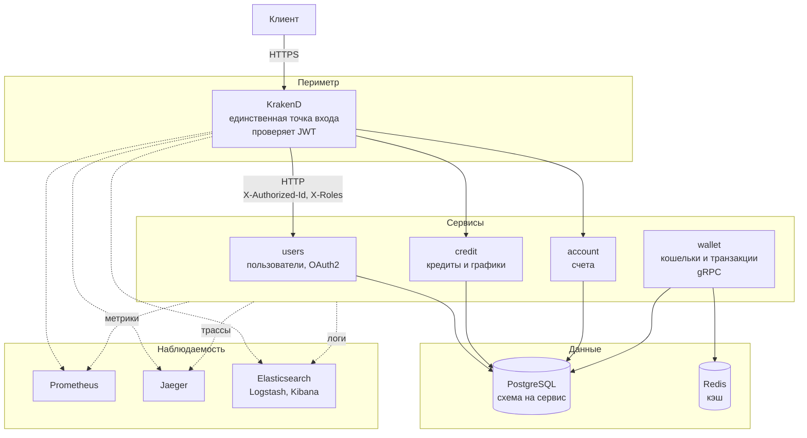
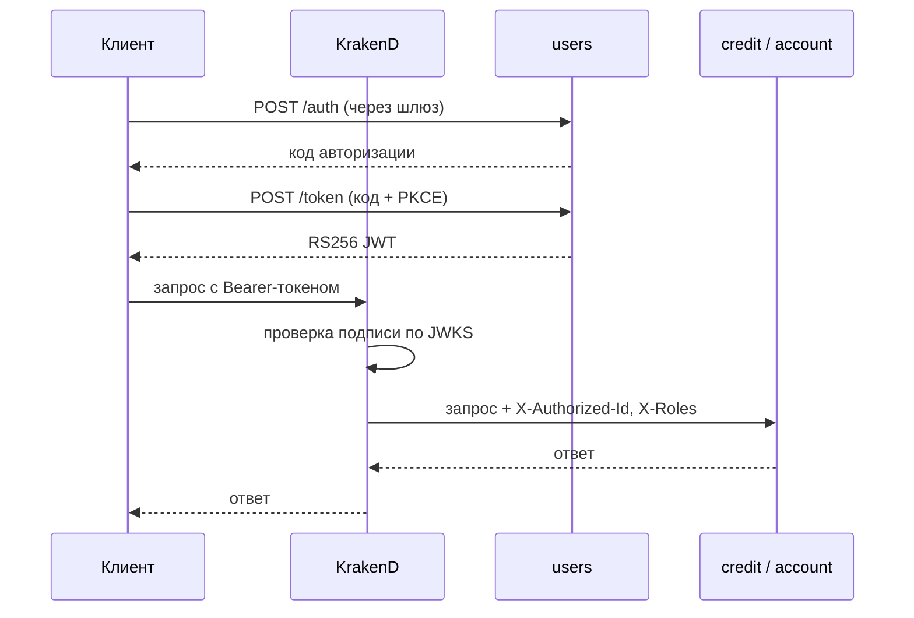

# Архитектура

Документ описывает систему как она есть сейчас, а не как задумывалась.
Нереализованные части помечены явно — иначе описание превращается
в рекламу.

## Уровень 1. Контекст

Пунктиром показано то, чего пока нет. Из внешних систем реально подключён
только Keycloak, и то как один из двух режимов аутентификации
(см. [ADR 0001](../adr/0001-auth-provider.md)).

## Уровень 2. Контейнеры

Кошелёк не подключён к шлюзу: KrakenD Community Edition не проксирует
gRPC-бэкенды. Сейчас к нему обращаться некому — межсервисных вызовов
в системе нет вовсе (см. T-049).

## Границы и владение данными

| Сервис | Владеет | Схема | Транспорт |
|---|---|---|---|
| `users` | пользователи, роли, OAuth2-клиенты, токены, ключи подписи | `users` | HTTP |
| `credit` | кредиты, платежи, архив кредитов | `credit` | HTTP |
| `account` | счета | `account` | HTTP |
| `wallet` | кошельки, транзакции | `wallet` | gRPC |

Правило одно: в чужую схему не ходит никто. Данные другого сервиса
запрашиваются его методами, а не запросом в его таблицы.

Схемы разделены, но лежат в одной базе. Это осознанный компромисс учебного
стенда: границы уже проведены, поэтому разнести базы физически можно будет
без изменения кода — меняется только строка подключения. Пока же одна база
означает общий отказ и общий пул соединений.

## Модель аутентификации

Сервисы за шлюзом не проверяют подпись: они получают уже проверенный
идентификатор в заголовке. Это работает ровно до тех пор, пока к ним нельзя
обратиться в обход шлюза — поэтому их порты наружу не публикуются.
Слабое место названо прямо: любой доступ во внутреннюю сеть даёт полный
доступ к API от имени любого пользователя. Устранение — в T-049 (mTLS
или проверка токена в самих сервисах).

## Почему сервисов четыре

Честный ответ: потому что это учебная цель проекта, а не потому что
так потребовала нагрузка или организация команд. `RULE.md` прямо называет
преждевременное разделение на микросервисы анти-паттерном, и здесь оно
именно преждевременное.

Что это уже стоило: четыре набора миграций, четыре точки входа, дублирование
конфигурации, невозможность транзакции между кредитом и кошельком.
Что дало: отработку границ, отдельных схем, шлюза и наблюдаемости.

Если бы задача была продуктовой, разумной отправной точкой был бы один
сервис с теми же внутренними границами.

## Требования к консистентности

| Данные | Требование | Как обеспечено |
|---|---|---|
| Баланс кошелька | строгая | транзакция с `SELECT ... FOR UPDATE`, ключ идемпотентности |
| Кредиты и платежи | строгая в пределах сервиса | транзакции PostgreSQL |
| Кошелёк и кредит вместе | не обеспечена | разные сервисы, распределённой транзакции нет |

Последняя строка — известное ограничение. Когда погашение кредита начнёт
списывать средства с кошелька, потребуется сага или outbox: двухфазный
коммит между сервисами не рассматривается.

## Решения

- [ADR 0001](../adr/0001-auth-provider.md) — два провайдера аутентификации
  с переключением.
- [ADR 0002](../adr/0002-oauth2-library.md) — библиотека OAuth2.
- [ADR 0003](../adr/0003-postgres-driver-and-layout.md) — драйвер PostgreSQL
  и структура каталогов.

## Чего в системе нет

Список желаний, котёл, шопоголик, интеграции с маркетплейсами, платёжный
контур, оповещения, профиль пользователя, межсервисное взаимодействие,
пользовательский интерфейс. Это не «в разработке» — этого нет совсем,
соответствующие задачи заведены в [TASKS.md](../../TASKS.md).
