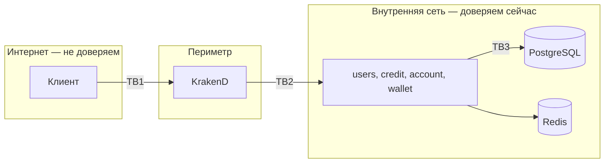

# Модель угроз

[REPORT.md](../REPORT.md) перечисляет найденные уязвимости — это разбор кода.
Здесь другое: активы, границы доверия и потоки данных, то есть то, из чего
уязвимости следуют. Обход аутентификации через `X-Authorized-Id` (T-001)
появился именно потому, что граница доверия между шлюзом и сервисами нигде
не была описана.

## Активы

Отсортированы по последствиям компрометации.

| Актив | Где | Чем грозит компрометация |
|---|---|---|
| Средства на кошельках | `wallet.wallet`, `wallet.transaction` | прямые финансовые потери |
| Приватные ключи подписи | `users.keys` | подделка любого токена, неотличимая от настоящего |
| Секрет подписи HMAC | `OAUTH2_GLOBAL_SECRET` | то же для непрозрачных токенов |
| Мастер-ключ шифрования | `KEY_MASTER_KEY` | доступ к приватным ключам из дампа БД |
| Административный токен | `ADMIN_TOKEN` | ротация ключей, создание клиентов |
| Персональные данные | `users.users` и будущий профиль | утечка ПДн |
| История операций | `wallet.transaction` | раскрытие финансового поведения |
| Секреты клиентов OAuth2 | `users.oauth_clients` | выпуск токенов от имени приложения |

## Границы доверия

- **TB1 — клиент/шлюз.** Единственная граница, где проверка действительно
  выполняется: шлюз валидирует подпись JWT по JWKS.
- **TB2 — шлюз/сервисы.** Сервисы принимают `X-Authorized-Id` на веру.
  Граница держится ровно на том, что порты сервисов не опубликованы наружу.
- **TB3 — сервисы/БД.** Соединение без TLS, пароль в переменной окружения.

## Нарушители

| Нарушитель | Возможности | Считаем ли актуальным |
|---|---|---|
| Внешний анонимный | запросы к шлюзу | да |
| Внешний аутентифицированный | валидный токен обычного пользователя | да |
| Получивший доступ во внутреннюю сеть | запросы напрямую к сервисам, минуя шлюз | да — и это худший сценарий |
| Разработчик с дампом БД | чтение всех данных, включая ключи | да |
| Оператор с доступом к контейнерам | чтение переменных окружения и памяти | да |
| Скомпрометированный соседний сервис | обращения ко всем сервисам от любого имени | да |

Три последних — внутренние нарушители. Их принято не рассматривать,
и именно поэтому они опаснее: против них в системе почти ничего нет.

## Разбор по STRIDE

### Подмена личности (Spoofing)

| Угроза | Состояние | Контрмера |
|---|---|---|
| Подстановка чужого `X-Authorized-Id` снаружи | закрыто | порты сервисов не публикуются, заголовок не входит в `input_headers` шлюза |
| То же изнутри сети | **не закрыто** | принятый риск; устранение — mTLS или проверка токена в сервисах (T-049) |
| Подделка токена подобранным ключом | закрыто | RS256, ключи 2048 бит, ротация |
| Подделка токена из дампа БД | закрыто | ключи шифруются AES-GCM (T-069) |
| Перебор паролей | **не закрыто** | ограничение частоты на шлюзе есть, блокировки после N попыток нет |

### Подделка данных (Tampering)

| Угроза | Состояние | Контрмера |
|---|---|---|
| Отрицательная сумма транзакции | закрыто | `CHECK (value > 0)` |
| Уход баланса в минус | закрыто | `CHECK (balance >= 0)` и проверка до записи |
| Потеря обновления при параллельных списаниях | закрыто | `SELECT ... FOR UPDATE` |
| Подмена трафика между сервисами и БД | **не закрыто** | TLS не включён (NFR-10) |
| Подмена шифротекста ключа | закрыто | AES-GCM проверяет целостность |

### Отказ от авторства (Repudiation)

| Угроза | Состояние | Контрмера |
|---|---|---|
| Отрицание совершённой операции | 🟡 частично | история транзакций ведётся, но не защищена от изменения администратором БД |
| Отсутствие следа административных действий | **не закрыто** | ротация ключей и создание клиентов не пишутся в отдельный журнал аудита |

### Раскрытие информации (Information Disclosure)

| Угроза | Состояние | Контрмера |
|---|---|---|
| Чтение чужого кошелька, кредита, счёта | закрыто | проверка владельца, чужие сущности отдаются как 404 |
| Перебор идентификаторов | закрыто | внешние идентификаторы — UUID (T-063) |
| Утечка внутренних ошибок клиенту | закрыто | `SendDebugMessagesToClients` выключен по умолчанию |
| Различие ответов на неизвестного пользователя и неверный пароль | закрыто | ответ одинаковый |
| Состояние рантайма через statsviz | закрыто | за флагом отладки |
| Метрики на публичном порту | закрыто | вынесены на служебный порт |
| ПДн в логах | 🟡 частично | имя пользователя больше не пишется при ошибке, но профиля пока нет |

### Отказ в обслуживании (Denial of Service)

| Угроза | Состояние | Контрмера |
|---|---|---|
| Медленные соединения (Slowloris) | закрыто | таймауты HTTP-сервера |
| Тело запроса произвольного размера | закрыто | `MaxBytesReader`, 1 МиБ |
| Выделение памяти по данным из БД | закрыто | границы срока кредита и переполнение устранены |
| Ротация ключей в цикле | закрыто | административный токен и ограничение частоты |
| Исчерпание пула соединений | 🟡 частично | пул ограничен, но защиты от медленных запросов нет |
| Неограниченный рост таблиц | 🟡 частично | токены чистятся, партиции создаются; удаления старых партиций нет (T-073) |

### Повышение привилегий (Elevation of Privilege)

| Угроза | Состояние | Контрмера |
|---|---|---|
| Выдача кредита другому пользователю | закрыто | роль оператора (T-064) |
| Создание счёта другому пользователю | закрыто | то же |
| Самостоятельное присвоение роли | закрыто | роли приходят из claim токена, а не из запроса |
| Подделка claim с ролями | сводится к подделке токена | см. Spoofing |
| Административные эндпоинты | закрыто | отдельный токен, сравнение постоянного времени |

## Денежный контур отдельно

| Угроза | Состояние | Контрмера |
|---|---|---|
| Двойное списание при повторе запроса | закрыто | обязательный ключ идемпотентности |
| Потеря операции при параллельных запросах | закрыто | блокировка строки кошелька |
| Частично выполненный перевод | закрыто | обе стороны в одной транзакции БД |
| Взаимная блокировка встречных переводов | закрыто | кошельки блокируются в порядке идентификаторов |
| Несогласованность кошелька и кредита | **не закрыто** | распределённой транзакции нет; появится с погашением кредита из кошелька |

## Принятые риски

Риски, которые осознанно не закрываются сейчас. Каждый — с условием,
при котором его придётся закрыть.

| Риск | Почему принят | Когда закрывать |
|---|---|---|
| Доверие к `X-Authorized-Id` внутри сети | учебный контур, внутренняя сеть под контролем | при первом же реальном пользователе |
| Отсутствие TLS между компонентами | локальный стенд | при выходе за пределы одной машины |
| Отсутствие журнала аудита | нет требования | при появлении реальных денег |
| Уязвимости в замороженном `fosite` | закрываются вручную | см. [ADR 0002](adr/0002-oauth2-library.md) |
| Отсутствие блокировки после N неудачных входов | учебный контур | при публичном доступе |

## Что проверяется автоматически

- `govulncheck` — известные уязвимости в зависимостях, включая транзитивные.
- `gosec` в составе `golangci-lint` — типовые ошибки безопасности в коде.
- Интеграционные тесты — проверка владельца, идемпотентность, отсутствие
  потерянных обновлений.
- Тесты авторизации — разбор заголовков и правила доступа.

Это не заменяет модель угроз: инструменты находят известные классы ошибок,
а не отсутствие контрмеры против конкретного нарушителя.
